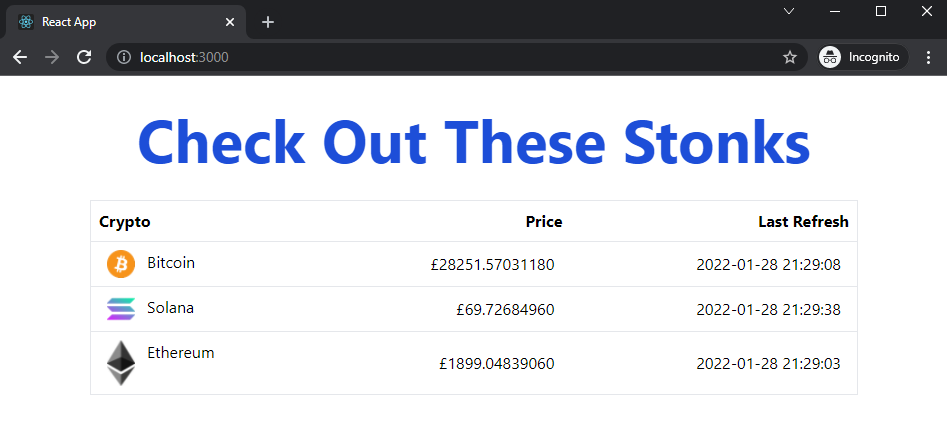

# REAL TIME STOCK/CRYPTO PRICE VIEWER

## Quick Start
1. Get a free API Key from https://www.alphavantage.co/
2. Run ``` git clone https://github.com/sa64r/realtime-stock-price-viewer.git ```
3. Run ``` cd realtime-stock-price-viewer ```
4. Create .env file in root directory
5. Add api key in the dotenv file as ``` REACT_APP_API_KEY={YOUR API KEY} ```
6. Run ``` npm start ```
7. Open http://localhost:3000/


## Extra Information
- Currently only shows (Bitcoin, Ethereum and Solana) prices
- Prices refresh every 60s
- NOT RELIABLE TO BASE TRADES ON


## Screenshot

